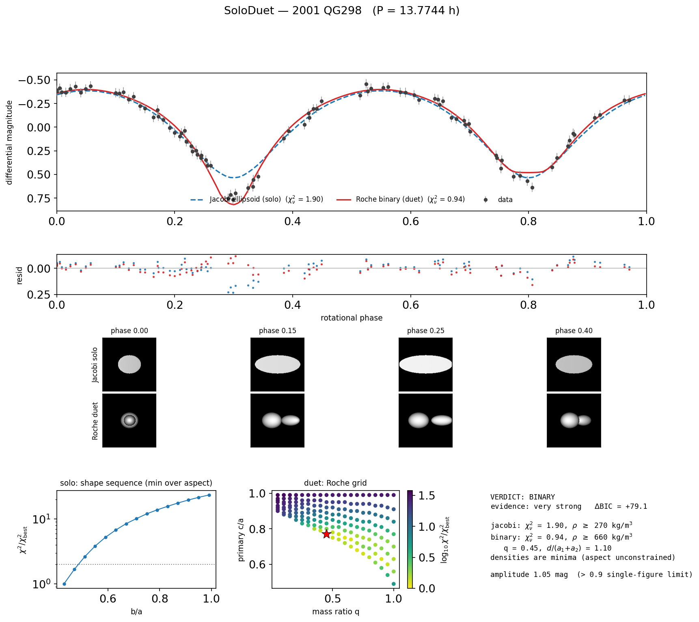
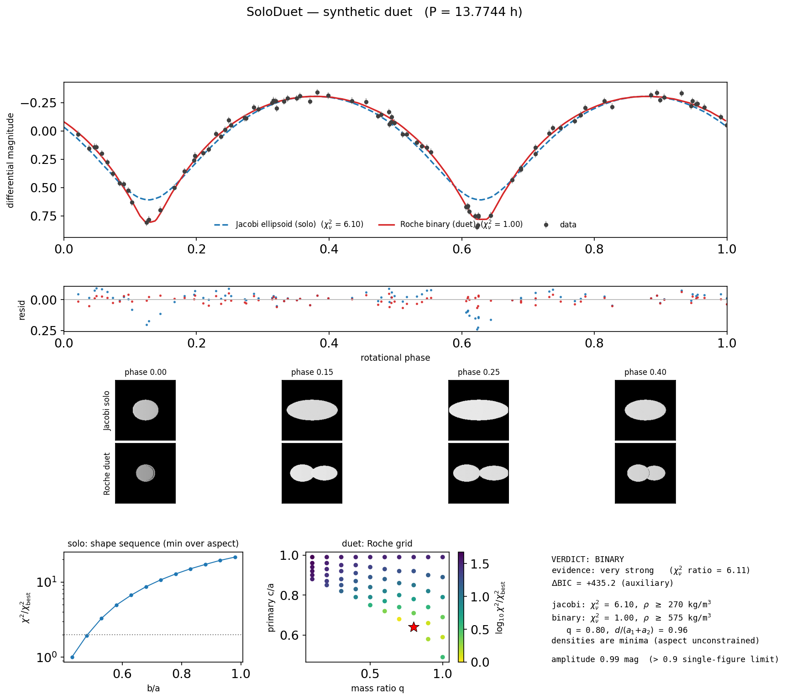

# SoloDuet

**Is that rotational light curve a *solo* elongated asteroid — or a *duet*?**

SoloDuet fits two physically motivated models to an asteroid (or Kuiper Belt
object) rotational light curve and reports which one the data prefer:

* a **single triaxial ellipsoid** — by default constrained to the fluid-equilibrium
  **Jacobi sequence**, so the fit yields a bulk density; optionally an
  unconstrained ("free") ellipsoid for strength-dominated bodies, and
* a **tidally locked Roche contact/close binary** — two mutually deformed
  equilibrium components in a circular, synchronous orbit, yielding a bulk
  density, mass ratio, and orbital separation.

The methodology follows the peer-reviewed framework of
[Lacerda & Jewitt (2007)](https://ui.adsabs.harvard.edu/abs/2007AJ....133.1393L)
[1], replacing their POV-Ray rendering step with a self-contained, validated
NumPy ray tracer, and augmenting the χ² comparison with information-criterion
statistics and independent light-curve morphology diagnostics.



*(139775) 2001 QG298, the prototype Kuiper Belt contact binary: SoloDuet's
verdict on the real Sheppard & Jewitt (2004) photometry [8], reproducing the
Lacerda & Jewitt (2007) result — a Roche binary at/near contact with bulk
density ≈ 590 kg m⁻³.*

---

## How it works

### The solo model: Jacobi figures

A homogeneous, self-gravitating fluid rotating uniformly about its shortest
axis takes a Maclaurin spheroid or — at higher angular momentum — a Jacobi
triaxial ellipsoid shape [2]. With semi-axes *a* ≥ *b* ≥ *c*, the Jacobi
condition

$$a^2 b^2 \int_0^\infty \frac{du}{(a^2+u)(b^2+u)\,\Delta} \;=\; c^2 \int_0^\infty \frac{du}{(c^2+u)\,\Delta}, \qquad \Delta^2 = (a^2+u)(b^2+u)(c^2+u)$$

fixes *c/a* for every *b/a*, and the normalized spin
ω²/(πGρ) follows from the same index symbols [1, 2]. Combined with the
observed rotation period, **the shape selects the bulk density**. The
sequence is bounded by *b/a* ≥ 0.43, below which the figure is unstable to
rotational fission [6]. The index symbols are evaluated with Carlson
symmetric elliptic integrals (`scipy.special.elliprd`), which are stable for
all axis ratios; the implementation reproduces the Maclaurin–Jacobi
bifurcation (*c/a* = 0.582724, ω²/(πGρ) = 0.374230 [2]) to 10⁻⁵.

### The duet model: Roche binaries

Each component is approximated as a **Roche ellipsoid** — the equilibrium
shape of a homogeneous, tidally locked body deformed by the spherically
symmetric gravity of its companion [1, 3, 4, 5]. The primary's shape is
computed with mass ratio *q* = m₂/m₁ and the secondary's with 1/*q*; a valid
binary is a pair sharing the same ω²/(πGρ), with equal densities and the
secondary rescaled to volume *q*·V₁. The orbital separation follows from
Kepler's third law and is quoted as *d*/(a₁+a₂), so ≈ 1 signals **contact**.
The full solution grid (*q* from 0.05 to 1.00) ships precomputed with the
package and reproduces Table 3 of Lacerda & Jewitt (2007) within the
tolerance of their grid pairing.

### Light-curve synthesis

Model light curves are rendered by an orthographic ray tracer: analytic
ray–ellipsoid intersections, a z-buffer for **mutual occultations**
(eclipses), and analytic shadow rays for **mutual shadowing** at non-zero
solar phase angle. Two scattering laws bracket realistic surfaces, following
[1]: **Lommel-Seeliger** ("lunar", dark surfaces; radiance μ₀/(μ₀+μ)) and
**Lambert** ("icy", bright surfaces; radiance μ₀). Hapke-type models are
deliberately excluded as unconstrainable by disk-integrated photometry [1].
The renderer matches (i) the analytic ellipsoid light curve of [1] (their
eq. 3) to ≲ 0.1 % in flux and (ii) the independent SpotLight renderer to
≲ 0.3 mmag when both are importable.

A third law, **"geometric"** (`--scattering geometric`), makes the
brightness proportional to the illuminated cross-section — the "uniform"
model of [1]. For the *solo* models this is evaluated with the exact
analytic projected-area light curve of a triaxial ellipsoid at arbitrary
aspect angle (**Surdej & Surdej 1978** [13]), whose prolate special case is
the Sheppard & Jewitt (2004) amplitude–aspect relation (the same model used
in the Simmer survey simulator); the duet has no closed form and uses the
uniform-radiance render. The analytic curve is exact at zero phase angle and
the customary small-α approximation otherwise.

### Fitting and the verdict

For every model class × scattering law, a grid over the shape sequence and
aspect angle is scanned (rotational phase offset and magnitude zero-point
are optimized analytically at no rendering cost), then the best node is
refined with a simplex. Parameter ranges quote the χ²/χ²(best) < 2 region
(≈ 1σ; [1]). The solo-vs-duet decision uses **ΔBIC** on the Kass & Raftery
(1995) evidence ladder [9], with ΔAIC and a (heuristic, non-nested) F-test
reported for context, corroborated by model-independent morphology
diagnostics:

* peak-to-peak range **> 0.9 mag** cannot be produced by a single
  equilibrium figure and demands a contact binary or albedo variegation
  [5, 7];
* **V-shaped minima with rounded maxima** are the classic contact-binary
  signature near zero phase angle [1, 11] — quantified by the curvature
  ratio of a Fourier fit at the extrema, and automatically flagged
  unreliable when the phase angle exceeds a few degrees (binary minima
  broaden with α [1]);
* unequal minima / odd-harmonic power indicate component asymmetry.

## What it decides — and what it can't

| Situation | SoloDuet's behaviour |
|---|---|
| Clear duet signature (deep V minima, Δm > 0.9 mag) | verdict **BINARY** with density, *q*, separation |
| Smooth quasi-sinusoidal curve | verdict **SINGLE** with density (Jacobi mode) |
| Both models fit equally well | verdict **INDETERMINATE** — the honest answer; cf. 2000 GN171 in [1] |
| Amplitude below ~4× the photometric noise | **INDETERMINATE** (no shape information) |
| Neither model fits (χ²ᵥ ≫ 1) | caveat: albedo spots, tumbling, or wrong period |
| Free-ellipsoid mode | no density is inferred (flagged in output) |

A single-apparition light curve cannot break the aspect–shape degeneracy: a
more elongated body viewed at low aspect mimics a rounder one viewed
equator-on. SoloDuet scans a grid of aspect angles (fix `--aspect` if the
pole is known) and reports the degeneracy in the 1σ ranges.

## Installation

```
git clone https://github.com/SarahSonnett/SoloDuet.git
cd SoloDuet
pip install -e .
```

Requires Python ≥ 3.9 with `numpy`, `scipy` ≥ 1.8, and `matplotlib`.
`astroquery` is optional (JPL Horizons geometry lookups). If the sibling
repositories [SpotLight](https://github.com/SarahSonnett/SpotLight),
[SpinDoc](https://github.com/SarahSonnett/SpinDoc), or
[Silhouette](https://github.com/SarahSonnett/Silhouette) are present next to
SoloDuet (or importable), they are used for cross-validation and richer
photometry parsing; SoloDuet runs standalone without them.

## Input format

Two kinds of photometry tables are accepted:

* **bare**: whitespace/comma-separated `time  mag  [magerr]`, JD or MJD
  auto-detected, `#` comments ignored;
* **headered** (SpinDoc/Silhouette style): a one-line header naming columns
  such as `MJD  mag  merr  rhelio  delta  alpha` (many aliases accepted);
  magnitudes are then reduced to unit distances and the phase angle is taken
  from the table.

## Quick start

Command line:

```
python fit_duet.py --infile data/2001qg298_sj2004.txt --period-hr 13.7744 \
                   --object "2001 QG298" --alpha 1.0 --jd-min 2452870
```

Python:

```python
import soloduet as sd

time, mag, merr, alpha = sd.read_lightcurve("my_photometry.txt")
lc = sd.phase_fold(time, mag, merr, period_hr=8.4, alpha_deg=alpha)
result = sd.fit_lightcurve(lc)
print(result.summary())

from soloduet.plotting import save_summary
save_summary(result, "my_object_summary.png")
```

Useful options: `--fast` (quick look), `--aspect 90` (known pole),
`--free-ellipsoid` (add the unconstrained solo mode),
`--scattering lunar` (single law). The CLI writes a text summary, a
machine-readable JSON, and the summary figure to `--outdir`.

### Conventions

* **Periods are in HOURS** and refer to the full (double-peaked) light-curve
  period: one **rotation** of a solo body = one **orbit** of a tidally
  locked duet. This is the single most common usage error.
* Differential magnitudes are relative to the inverse-variance weighted
  mean; magnitudes increase downward in all plots.
* Duet rotational phase 0 is conjunction (the mutual-event minimum); solo
  phase 0 views the long axis end-on (a light-curve minimum).

## Worked examples

| script | what it shows |
|---|---|
| `example.py` | self-checking solo round trip: synthesize a Jacobi figure, recover shape + density, verdict SINGLE |
| `example_binary.py` | self-checking duet round trip: synthesize a near-contact q = 0.8 Roche binary, recover q + density, verdict BINARY |
| `example_2001qg298.py` | the real Sheppard & Jewitt (2004) photometry of 2001 QG298; reproduces the Lacerda & Jewitt (2007) contact-binary verdict and ρ ≈ 590 kg m⁻³ |
| `example_known_objects.py` | field test on two ground-truth objects with real archived photometry (below) |

### Field test: ground-truth objects

`example_known_objects.py` runs two objects whose natures are known
independently of light curves — dense archived photometry from DAMIT [14],
aspect angles fixed from the published spin poles — through the identical
pipeline:

| object | ground truth | SoloDuet verdict | recovered vs. truth |
|---|---|---|---|
| (216) Kleopatra | bilobed "dog-bone" (radar/AO: Ostro et al. 2000; Shepard et al. 2018); ρ = 3.38 g/cm³ from its moons (Marchis et al. 2021) | **BINARY** (very strong, ΔBIC ≈ +100) | near-contact separation d/(a₁+a₂) ≈ 0.98; ρ ≈ 3.8 g/cm³ (11% above the satellite-orbit value) |
| (433) Eros | single elongated body (NEAR Shoemaker: 34.4 × 11.2 × 11.2 km; Veverka et al. 2000) | **SINGLE** (very strong, ΔBIC ≈ −400) | free-ellipsoid b/a ≈ 0.40 vs. 0.33 in situ; binary model rejected at χ²ᵥ 8.5 vs. 5.6 |

Both curves have ranges just above the 0.9-mag strengthless single-figure
limit — Kleopatra because it *is* two lobes, Eros because it is a
strength-dominated monolith — so the pair also exercises the caveat
machinery: Eros's summary explicitly warns that a single body this
elongated requires internal strength, and neither object's χ²ᵥ is allowed
to masquerade as a perfect fit (real surfaces have albedo features and
non-ellipsoidal topography).

Also try (624) Hektor, the prototype Trojan contact binary [7]: its
lightcurve range varies 0.1–1.2 mag with viewing geometry, and Lacerda &
Jewitt (2007) find ρ ≈ 2480 kg m⁻³ with q ≈ 0.6.



## Relationship to sibling repositories

SoloDuet is part of an asteroid-photometry toolset alongside
[SpotLight](https://github.com/SarahSonnett/SpotLight) (forward
triaxial-ellipsoid renderer — used here to cross-validate the two-body ray
tracer), [SpinDoc](https://github.com/SarahSonnett/SpinDoc) (rotation
periods and H-G phase curves — find your period there first) and
[Silhouette](https://github.com/SarahSonnett/Silhouette) (analytic
shape/pole from multi-apparition amplitudes). SoloDuet answers the question
those tools leave open: *given the period and the folded light curve, is
this one body or two?*

## Testing

```
python -m pytest tests/
```

The suite pins the numerics to literature anchors: the Maclaurin–Jacobi
bifurcation constants [2], Table 3 of Lacerda & Jewitt (2007) for the Roche
solutions, the analytic ellipsoid light curve (their eq. 3), SpotLight
cross-validation, exact occultation depths for eclipsing spheres, and full
synthesize-and-recover round trips for both verdicts.

## References

1. Lacerda, P., & Jewitt, D. C. 2007, *Densities of Solar System Objects
   from Their Rotational Light Curves*, AJ, 133, 1393.
   [2007AJ....133.1393L](https://ui.adsabs.harvard.edu/abs/2007AJ....133.1393L),
   [doi:10.1086/511772](https://doi.org/10.1086/511772)
2. Chandrasekhar, S. 1969, *Ellipsoidal Figures of Equilibrium* (New Haven:
   Yale Univ. Press). [1969efe..book.....C](https://ui.adsabs.harvard.edu/abs/1969efe..book.....C)
3. Chandrasekhar, S. 1963, *The Equilibrium and the Stability of the Roche
   Ellipsoids*, ApJ, 138, 1182.
   [1963ApJ...138.1182C](https://ui.adsabs.harvard.edu/abs/1963ApJ...138.1182C)
4. Chandrasekhar, S., & Lebovitz, N. R. 1962, ApJ, 136, 1037.
   [1962ApJ...136.1037C](https://ui.adsabs.harvard.edu/abs/1962ApJ...136.1037C)
5. Leone, G., Farinella, P., Paolicchi, P., & Zappalà, V. 1984,
   *Equilibrium Models of Binary Asteroids*, A&A, 140, 265.
   [1984A&A...140..265L](https://ui.adsabs.harvard.edu/abs/1984A%26A...140..265L)
6. Jeans, J. H. 1919, *Problems of Cosmogony and Stellar Dynamics*
   (Cambridge: Cambridge Univ. Press)
7. Weidenschilling, S. J. 1980, *Hektor: Nature and Origin of a Binary
   Asteroid*, Icarus, 44, 807.
   [1980Icar...44..807W](https://ui.adsabs.harvard.edu/abs/1980Icar...44..807W)
8. Sheppard, S. S., & Jewitt, D. 2004, *Extreme Kuiper Belt Object
   2001 QG298 and the Fraction of Contact Binaries*, AJ, 127, 3023.
   [2004AJ....127.3023S](https://ui.adsabs.harvard.edu/abs/2004AJ....127.3023S)
9. Kass, R. E., & Raftery, A. E. 1995, *Bayes Factors*, J. Am. Stat.
   Assoc., 90, 773. [doi:10.1080/01621459.1995.10476572](https://doi.org/10.1080/01621459.1995.10476572)
10. Schwarz, G. 1978, *Estimating the Dimension of a Model*, Ann. Statist.,
    6, 461
11. Thirouin, A., & Sheppard, S. S. 2018, *The Plutino Population: An
    Abundance of Contact Binaries*, AJ, 155, 248.
    [2018AJ....155..248T](https://ui.adsabs.harvard.edu/abs/2018AJ....155..248T)
12. Muinonen, K., & Lumme, K. 2015, *Light Scattering by Gaussian Particles
    ... Lommel-Seeliger ellipsoids*, A&A, 584, A23 (analytic
    Lommel-Seeliger ellipsoid photometry underpinning the zero-phase
    validation)
13. Surdej, J., & Surdej, A. 1978, *Asteroid lightcurves simulated by the
    rotation of a three-axes ellipsoid model*, A&A, 66, 31.
    [1978A&A....66...31S](https://ui.adsabs.harvard.edu/abs/1978A%26A....66...31S)
14. Ďurech, J., Sidorin, V., & Kaasalainen, M. 2010, *DAMIT: a database of
    asteroid models from inversion techniques*, A&A, 513, A46.
    [2010A&A...513A..46D](https://ui.adsabs.harvard.edu/abs/2010A%26A...513A..46D)
    (source of the archived (216) Kleopatra and (433) Eros photometry in
    `data/`)

Descamps, P. 2015 (Icarus, 245, 64) computes true dumb-bell single-surface
equilibrium figures for contact binaries — a natural future refinement of
the two-ellipsoid Roche approximation used here.

## Citing

If SoloDuet is useful in your research, please cite this repository (see
`CITATION.cff`) together with Lacerda & Jewitt (2007), whose method it
implements.

---

S. Sonnett — Part of an asteroid photometry toolset alongside
[SpotLight](https://github.com/SarahSonnett/SpotLight),
[SpinDoc](https://github.com/SarahSonnett/SpinDoc),
[Silhouette](https://github.com/SarahSonnett/Silhouette), and
[WISETrails](https://github.com/SarahSonnett/WISETrails).
